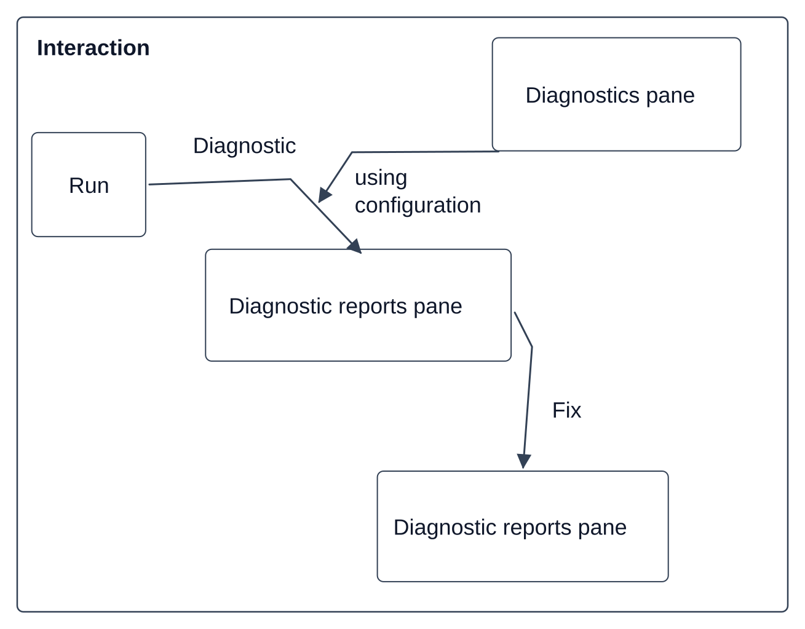

> Язык: [[User interface|English]] · **Русский**

Revit Linter использует закрепляемые панели для конфигурации и результатов, а также кнопки ленты для отображения этих панелей или открытия файлов конфигурации.

- [[Закрепляемые панели]]
- [[Кнопки ленты]]

[[Документация]]
